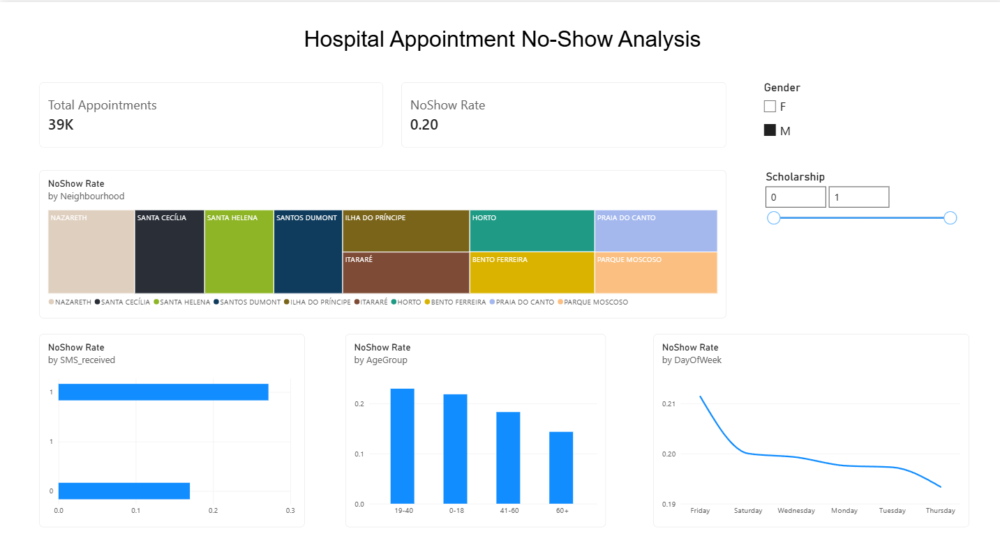

# Hospital Appointment No-Show Analysis



## 📌 Project Overview
This project analyzes a dataset of over 110,000 medical appointments in Brazil to determine the key factors that cause patients to miss their scheduled appointments (No-Shows). The goal of this analysis is to provide actionable insights to hospital administrators to improve attendance rates and optimize hospital operations.

## 🛠️ Tools & Technologies
- **Python**: Primary programming language.
- **Pandas**: Data cleaning, manipulation, and feature engineering.
- **Matplotlib & Seaborn**: Data visualization.

## 📂 Project Structure
- `data/`: Contains the raw Kaggle dataset and the cleaned dataset generated by the script.
- `src/`: Contains `analyze_appointments.py`, the main ETL and analysis script.
- `outputs/`: Contains the generated bar charts (PNGs) and the aggregated insights CSV.
- `hospital_dashboard.pbix`: The complete, interactive Power BI Dashboard file containing custom DAX measures. (Download this file to interact with the visualizations!)

## 📈 Key Insights & Findings
1. **The SMS Paradox**: Patients who received an SMS reminder actually had a higher no-show rate (27.6%) compared to those who did not (16.7%). This indicates the current SMS targeting logic is flawed or ineffective.
2. **Age Demographics**: Young adults (19-40 years) are the most likely to miss appointments (23.2%), whereas seniors (60+ years) are the most reliable (15.2% no-show rate).
3. **Day of the Week**: Saturdays have the highest overall no-show rate (23.1%), followed closely by Fridays (21.2%). 

## 🚀 How to Run the Project
1. Clone the repository.
2. Ensure you have the required libraries installed: `pip install pandas matplotlib seaborn`.
3. Navigate to the `src/` folder and run the analysis script:
   ```bash
   python analyze_appointments.py
   ```
4. Check the `outputs/` folder for the generated insights and charts.
